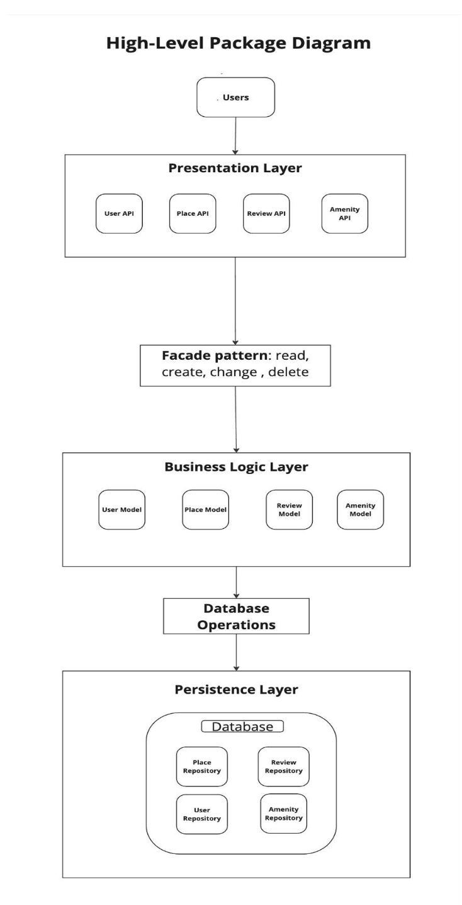
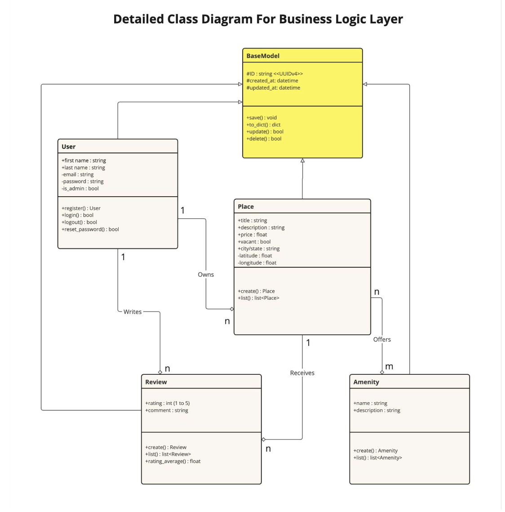

# Doc HbnB

## 1. Introduction

This technical documentation outlines the architecture and functionality of **HbnB**, an application inspired by Airbnb. Its purpose is to allow users to sign up, list properties, manage locations, amenities, and leave reviews.

The goal of this documentation is twofold:

1. Provide a clear overview of the project's structure and the interactions between its different components.  
2. Serve as a guide to ensure a consistent and efficient implementation.

It covers:

- The overall architecture of the project and its organization into layers (presentation, business logic, persistence).
- The data models and their relationships (users, places, reviews, amenities).
- The interactions between different layers through RESTful APIs.

---

## 2. Package Diagram

### Layered Architecture

The **HBnB Evolution** project follows a **three-layer architecture**, designed to separate concerns and enhance maintainability:

1. **Presentation Layer**  
   Includes services and APIs that handle user interactions, such as user registration, authentication, and listing management.

2. **Business Logic Layer**  
   Contains the core classes and business rules that define the application's functionality, including data validation, security checks, and business operations.

3. **Persistence Layer**  
   Responsible for data storage and retrieval from the database, ensuring data integrity and efficient query execution.

### Explanation

- The **Presentation Layer** provides an interface for users to interact with the system through APIs and front-end services.
- The **Business Logic Layer** ensures that all operations comply with business rules before interacting with the database.
- The **Persistence Layer** manages all interactions with the underlying database.
- The **Facade Design Pattern** is implemented to simplify interactions between layers, improving modularity and maintainability.

---

## 3. Class Diagram

### Main Entities

- **User**  
  Represents registered users who can create places and write reviews. Users have unique IDs and attributes such as name, email, and role.

- **Place**  
  Represents accommodations listed by users. Each place has attributes like title, description, price, and location.

- **Review**  
  Represents user feedback on places. Each review includes a rating, comment, and timestamp.

- **Amenity**  
  Defines additional features that a place can offer, such as Wi-Fi, parking, or a swimming pool.

### Relationships

The relationships between classes establish ownership and interactions between users, places, reviews, and amenities.

> In the future, additional classes such as **State** or **City** could be introduced to further define the location of places. These additions would enhance geographic structuring without changing the core relational model.

---

## 4. Sequence Diagram

### RESTful API Design

The system uses RESTful APIs to handle interactions between the front-end and back-end layers.

### Sequence Diagrams

These diagrams illustrate:

- User registration and authentication
- Listing creation
- Adding reviews
- Fetching places and amenities

*_(Include sequence diagrams showing these actions)_*

---

## 5. Conclusion

This document provides a structured overview of the **HBnB Evolution** project, covering the system's architecture, data model, and interaction flows.

The layered design ensures **scalability** and **maintainability**, while the UML diagrams offer clear insights into class relationships and API communications.

This documentation serves as a crucial reference for **developers and stakeholders** throughout the project lifecycle.

---
