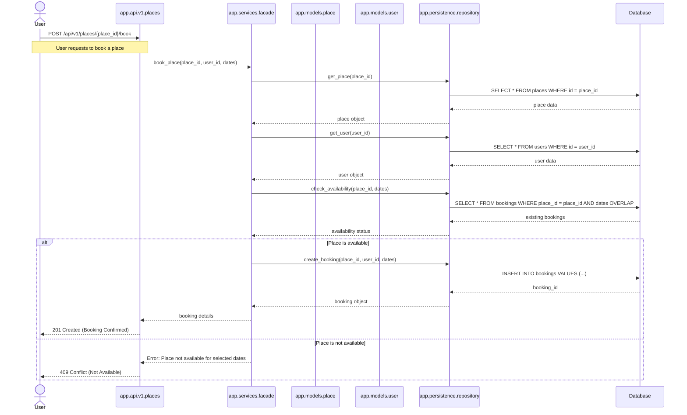

# Business Logic and API Endpoints Implementation
## Table of Contents
- [Description](#description)
- [Project Structure](#project-structure)
- [Business Logic Layer](#business-logic-layer)
- [Testing & Validation](#testing--validation)
- [Sequence Diagramme](#sequence-diagramme)
- [Conclusion](#conclusion)
- [Authors](#authors)
## Description
This phase of the HBnB project involves implementing the core functionalities of the application using Python and Flask. The goal is to build the presentation and business logic layers, define essential classes, methods, and API endpoints based on the design created in the previous phase.
## Project Structure
```
hbnb/
|-- app/
|   |-- __init__.py
|   |-- api/
|   |  |-- __init__.py
|   |  |-- v1/
|   |      |-- __init.py
|   |      |-- users.py
|   |      |-- places.py
|   |      |-- reviews.py
|   |      |-- amenities.py
|   |-- models/
|   |   |-- __init__.py
|   |   |-- user.py
|   |   |-- place.py
|   |   |-- review.py
|   |   |-- amenity.py
|   |-- services/
|   |   |-- __init__.py
|   |   |-- facade.py
|   |-- persistence/
|   |   |-- __init__.py
|   |   |-- repository.py
|-- run.py
|-- config.py
|-- requirements.txt
|-- README.md
```
### Folder and File Descriptions
| Directory/File      | Description                                                       |
|---------------------|-------------------------------------------------------------------|
| `app/`              | Main application folder.                                         |
| `api/`              | API endpoints organized by version (`v1/`).                      |
| `models/`           | Business logic classes (`user.py`, `place.py`, etc.).             |
| `services/`        | Implements the Facade pattern to manage interaction between layers.|
| `persistence/`     | In-memory repository for object storage and validation.           |
| `run.py`           | Flask application entry point.                                    |
| `config.py`        | Application environment and settings configuration.               |
| `requirements.txt` | List of Python packages required.                                 |
| `README.md`        | Project overview and documentation.                               |

## Requirements
### Installing Dependencies
List of the required Python packages in requirements.txt:
```
flask
flask-restx
```
Install dependencies:
```
pip install -r requirements.txt
```
### Running the Application
Start the Flask application:
```
python run.py
```
The app should run successfully, confirming the project structure and initial setup are ready for further development.
## Business Logic Layer
### Entities
- **User**: Represents a user of the application. A user can have multiple places.
- **Place**: Represents a place to stay. A place can have multiple reviews and multiple amenities.
- **Review**: Represents a review for a place.
- **Amenity**: Represents an amenity for a place.
### Relationships
- **User → Place**: A user can have multiple places.
- **Place → Review**: A place can have multiple reviews.
- **Place :left_right_arrow: Amenity**: A place can have multiple amenities and an amenity can belong to multiple places.
### Examples

## API Documentation
This section describes the available API endpoints and the expected request and response formats.
### User Endpoints
| Method | Endpoint             | Description                    |
|--------|----------------------|--------------------------------|
| POST   | `/api/v1/users/`     | Create a new user             |
| GET    | `/api/v1/users/`     | Retrieve the list of users    |
| GET    | `/api/v1/users/<id>` | Retrieve a user by ID         |
| PUT    | `/api/v1/users/<id>` | Update a user                 |

Example request to create a user:
```sh
curl -X POST http://127.0.0.1:5000/api/v1/users/ \
     -H "Content-Type: application/json" \
     -d '"'"'{
           "first_name": "John",
           "last_name": "Doe",
           "email": "john.doe@example.com",
           "password": "securepassword"
         }'"'"'
```
**Expected response:**
```json
{
    "message": "User created",
    "id": "169f8bef-9fc7-47d5-b4fa-b9b8e52ad2bb"
}
```
---
### Amenity Endpoints
| Method | Endpoint                 | Description                    |
|--------|--------------------------|--------------------------------|
| POST   | `/api/v1/amenities/`     | Create a new amenity           |
| GET    | `/api/v1/amenities/`     | Retrieve the list of amenities |
| GET    | `/api/v1/amenities/<id>` | Retrieve an amenity by ID      |
| PUT    | `/api/v1/amenities/<id>` | Update an amenity              |

Example request to retrieve all amenities:
```sh
curl -X GET http://127.0.0.1:5000/api/v1/amenities/
```
**Expected response:**
```json
[
    {
        "id": "e21a1c63-f19c-4c74-b8c3-f7efb4a5d12c",
        "name": "Wi-Fi"
    }
]
```
---
## Testing & Validation
To ensure that the API works correctly, we performed multiple tests:
1. **Input validation**: Checking data types and required fields.
2. **Endpoint testing with cURL**:
    - Creating and retrieving users and amenities.
    - Updating user information.
    - Handling errors (e.g., user not found, invalid request).
    - Documentation on testing with cURL here: [cURL tests](https://github.com/SpacePistache/holberton-hbnb/blob/main/part2/hbnb/documentation/CURL_TESTS.md)
3. **Swagger Documentation**:
    - All endpoints are documented using \`flask-restx\` to generate an interactive API documentation.
    - Documentation on testing with Swagger here: [Swagger tests](https://github.com/SpacePistache/holberton-hbnb/blob/main/part2/hbnb/documentation/SWAGGER_TESTS.md)
### Running Tests
Run unit tests using `unittest`:
```sh
python -m unittest discover tests
```
---
## Sequence Diagramme

## Conclusion

This project implements the Presentation, Business Logic, and Persistence layers using Flask and `flask-restx` to manage a RESTful API. The User, Place**, Review, and Amenity entities have been developed with their relationships. Each endpoint has been tested to ensure a reliable and functional API.

---
## Authors
- Nicolas Lassouane
- Salomee Perton Couriaut
- Luke Holley-Boutillier